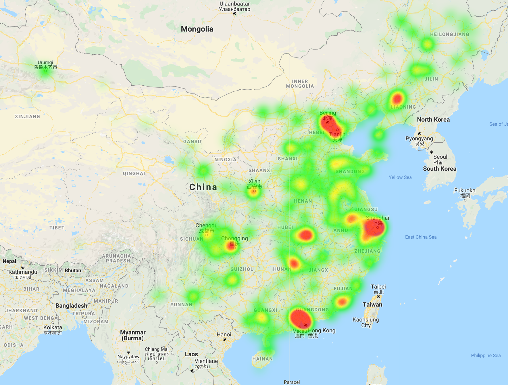

  

      <ul class="nav">
          <li><a href="geneticmaps_fig3.html">prev</a></li>
          <li><a href="tian2016_fig4.html">next</a></li>
      </ul>
  

[Final_Project](http://kbroman.org/qtlcharts), the daytime server usage 
heatmap from 3:00pm to 4:00pm, Nov.1st, 2018

Red area shows intensive usage of server.
matrix; click a pixel and the corresponding scatterplot is shown on
the right.
