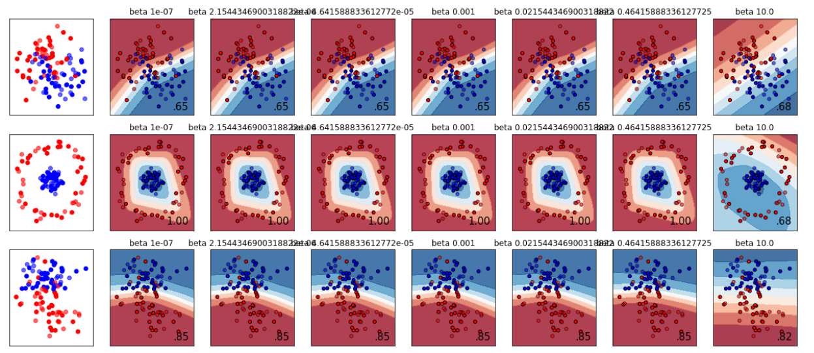

  

      <ul class="nav">
          <li><a href="samplemixups_fig7.html">prev</a></li>
          <li><a href="rqtlbook.html">next</a></li>
      </ul>
  

Graph generated from Homework 3 -- Varying regularization in Multi-layer Perceptron
[Genetics](http://genetics.org) 201:1253-1262

