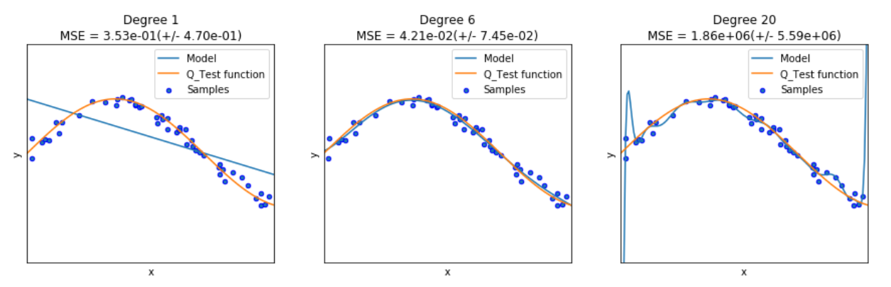

  

      <ul class="nav">
          <li><a href="tian2016_fig4.html">prev</a></li>
          <li><a href="isletc6_fig4.html">next</a></li>
      </ul>
  

Graph generated from assignment 3 - Underfitting and Overfitting[G3](http://g3journal.org)
5:2177-2186

