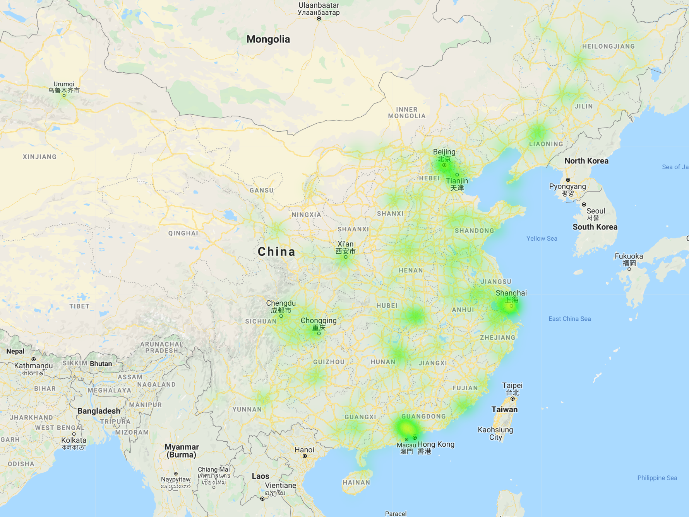

  

      <ul class="nav">
          <li><a href="iplotCorr.html">prev</a></li>
          <li><a href="samplemixups_fig7.html">next</a></li>
      </ul>
  

The night time map fo same region and same servers, from Nov.2nd 3:00am to 4:00am

